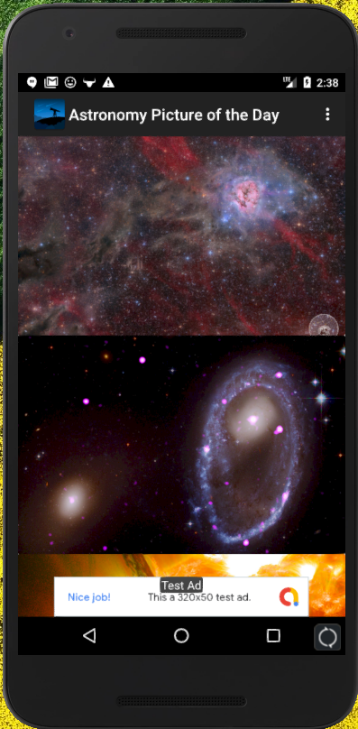
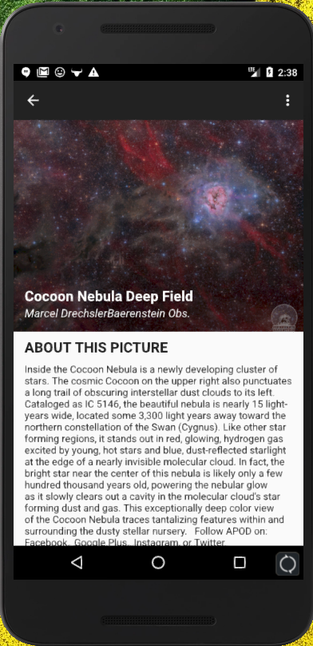
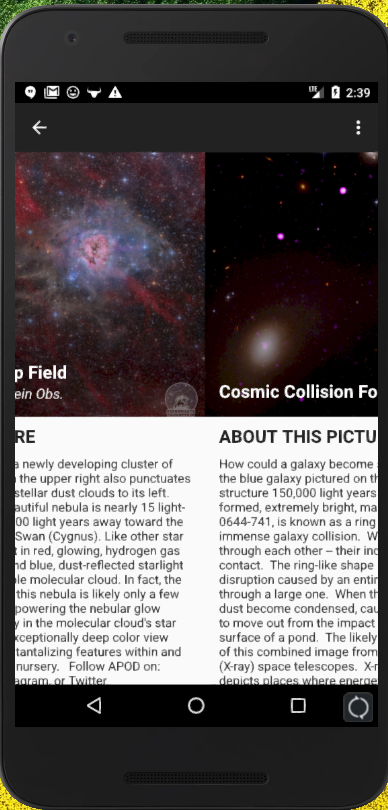
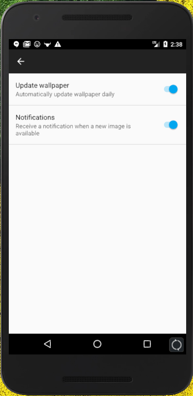
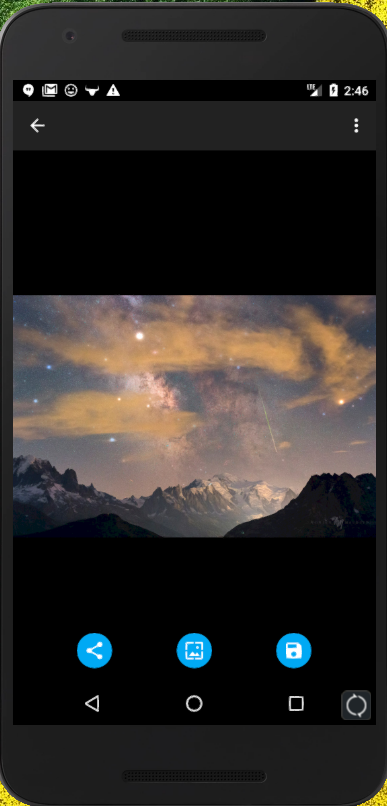
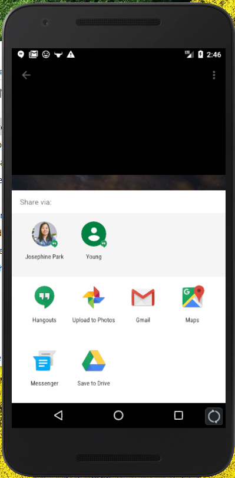
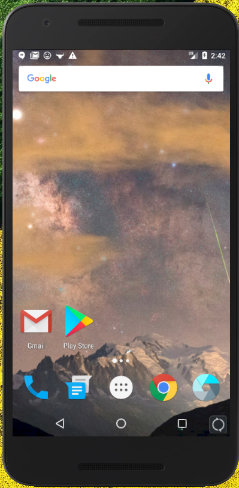

# AstronomyPictureoftheDay
Android app that displays content from nasa's apod service  
 
The application follows MVVM architecture  
A single activity pattern is used for flexible UI  
Dagger 2 is used for handling dependencies  
RxJava 2 is used for backround tasks  
JSON data is fetched from NASA's APOD Service  
Picasso is used for image loading  
Room is used for persistent data storage which allows for offline use  
RecyclerView with a LinearLayoutManager is used to show the list of images  
Firebase JobDispatcher is used for recurring background tasks  
 
The main screen shows the latest images from the APOD service:  
  
 
The detail screen shows a brief explanation written by astronomy professors:  
  
 
ViewPaper allows for horizontal scrolling:  
  
 
The Settings Screen allows users to toggle notifications and daily wallpaper updates  
  
Clicking on the image opens a screen for detailed image viewing which allows zooming in/out:  
  
 
On this detail screen, users can share the image or choose to :  
  
 
Users can also set the image as wallpaper on the homescreen or the lockscreen  
  
 
  
 
Users can also choose to save the image to external storage and have Google Photos scan the image  
  
 
If you would like to try out the app, 
sign up for an API key at: https://api.nasa.gov/index.html#apply-for-an-api-key, 
then enter the key at network/RetrofitService
 
Thank you for reading!  
Any suggestions will be greatly appreciated!  
